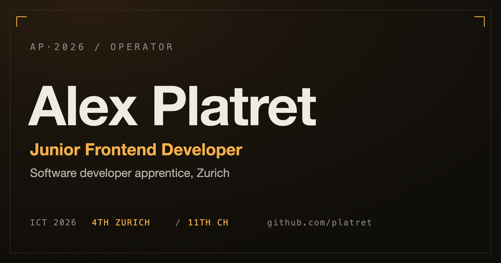

<div align="center">



<br/>
<br/>

# Portfolio &middot; Alex Platret

#### A personal site built as a powered-on instrument. The page reports real telemetry about a developer, so it is the proof, not the pitch.

<br/>

[](https://platret.github.io/portfolio/)
[](#)
[](#)
[](#)

<br/>


</div>

---

## The idea

A flight deck, not a brochure. Warm graphite, amber phosphor, hairline seams. Every claim on the page is demonstrated rather than asserted:

- A **live frame readout** in the masthead reads the page's actual measured frame time off one shared `requestAnimationFrame`.
- An **oscilloscope** in the systems bay traces real frame deltas from a fixed `Float32Array` ring buffer, allocation-free.
- Status **LEDs are wired to real deploy state**. A working URL reads green `LIVE`, source-only reads amber `REPO`. No fake demos.
- A **live backtracking solver** runs in the browser, the same class of solver that verifies KillerSudoku's puzzles are provably unique.
- Each project's architecture is drawn as a **leader-lined SVG schematic** where every callout lands on a real node.
- The name **assembles from tetromino blocks** on load, then settles into the wordmark.

Everything respects `prefers-reduced-motion` (built first, not bolted on), is keyboard navigable with visible focus, and ships a static accessible resume route that is always one tap away.

## Stack

| Layer | Choice |
|---|---|
| Build | **Vite 5**, TypeScript strict |
| UI | **React 18** |
| Styling | **Tailwind CSS 3** over OKLCH design tokens |
| Motion | **motion** (motion.dev) |
| Shader | **@paper-design/shaders-react** (pinned, app-managed mount) |
| Type | Hanken Grotesk (human voice), Martian Mono (instrument), Geist Mono (source), self-hosted |

No component library. The instrument kit is bespoke.

## Develop

```bash
npm install
npm run dev        # http://localhost:5173
```

## Build

```bash
npm run build      # type-check + production build to dist/
npm run preview    # serve the production build locally
```

## Deploy

Pushing to `main` triggers `.github/workflows/deploy.yml`, which builds with the project base path and publishes to GitHub Pages:

```bash
git push origin main          # CI builds with BASE_PATH=/portfolio/ and deploys
```

Deploying elsewhere (Vercel, Netlify, a root domain) needs no base path; the default is `/`.

## Structure

```
src/
  components/        instrument kit (masthead, strips, gauge, scope, schematics)
  components/schematics/   one SVG technical drawing per project
  engine/solver.ts   real MRV backtracking Sudoku solver
  hooks/             shared rAF, count-up, in-view, hash route
  lib/data.ts        all content, verified, nothing invented
DESIGN.md            the design system
PRODUCT.md           audience, voice, principles
```

## Contact

[platret.alex@gmail.com](mailto:platret.alex@gmail.com) &middot; [github.com/platret](https://github.com/platret) &middot; [@jacknos_](https://x.com/jacknos_)
